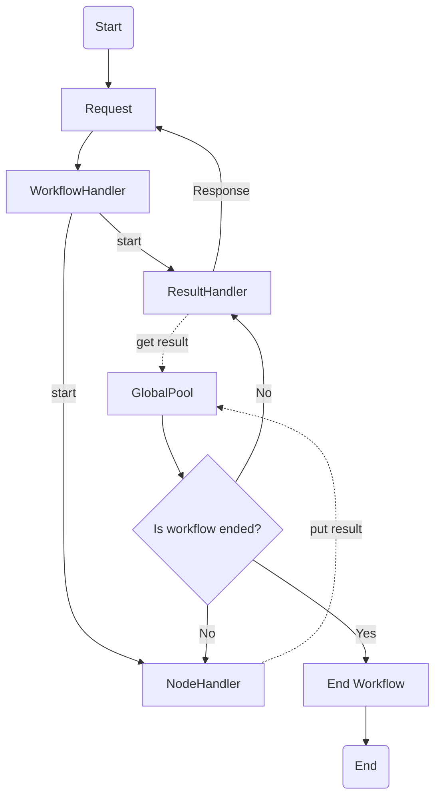
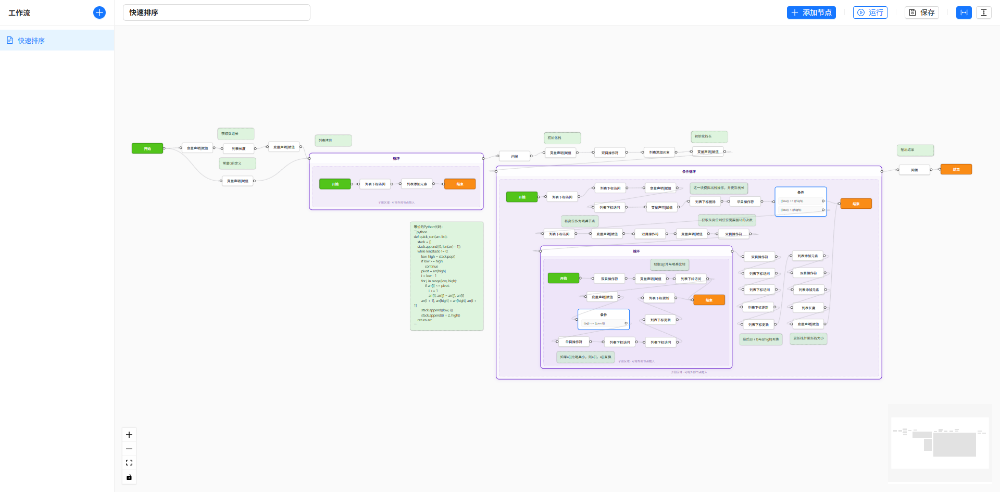

# Workflow for Java

## 简介

这是一个由Java构建的Spring Boot后端、Vue前端的Workflow项目，能够并发的执行工作流中的分支。通过Redis记录工作流的各项工作以及其中的变量，可以随时监控工作流的进度信息。

目前，该项目仍然处于Demo阶段，您可以自定义节点并将其放入流程图中运行以测试其效果。

## 工作原理



### 入口（WorkflowHandler）

用户在前端配置Workflow后，请求后端进行执行，后端在收到用户的请求后，将请求交由WorkflowHandler进行执行，WorkflowHandler会做出如下的操作:

1. 解析WorkflowVO（前端传递的Workflow配置），将其转化为相应的DTO（Workflow）,DTO在初始化时会创建相应的标识符（Token），随后向GlobalPool写入当前工作流的状态为初始化;

2. Workflow初始化完成后，WorkflowHandler会启动ResultHandler线程，ResultHandler线程会处理当前工作流产生的结果。随后，WorkflowHandler会向结果队列中放入一份结果，告知用户已经开始处理当前流程，并将当前流程图运行状态置为运行态;

3. 启动NodeHandler线程，使其开始处理Workflow的起始节点。

由于Workflow中启动的线程皆为虚拟线程，且交由Spring的任务管理，因此其不会阻塞整个Spring线程，WorkflowHandler在启动相关线程后退出。


### 结果处理线程（ResultHandler）

结果处理线程会在启动后循环执行，每个工作流都会启动自己的结果处理线程。结果处理线程会按照如下的方式运行：

1. 初始化时，写入结果处理线程状态为运行态（这一点可以用于前端用户查询或在测试时判断结果处理线程是否已经退出）；

2. 获取一份工作流的结果，并判断当前工作流是否已经退出，若其已经退出，则退出当前循环，并主动向结果队列放入一份工作流运行结束的结果；

3. 若获取到的工作流结果不为空，则向用户返回获取到的结果，循环2；

4. 若已经退出，则继续获取剩余的结果数据，直至结果队列为空，随后将结果处理线程状态置为完成态（争议，此处可以不写，当为了强调逻辑完整性，这里依旧存在相关逻辑），而后删除当前工作流在全局变量池中的所有数据。

### 节点处理线程（NodeHandler）

节点处理线程会依次处理节点的before、run、after方法，由于不同的节点需要执行不同的方法，所有节点必须继承基础节点（NodeImpl）并按需重写相应的Hook以保证节点正常运行。NodeHandler会在执行完节点的相应方法后开始处理当前节点的下游节点（这里的下游节点皆为直接下游，即只通过一层关系————或者说一条边————连接的节点）。具体处理过程大体如下：

1. 前置Hook处理：

    1.1. 判断当前节点的状态和工作流的状态，若当前节点的前置节点全部处于失能态（Disabled），应当将当前节点也置于失能态，随后退出前置Hook处理；若当前工作流已经提前结束，则直接退出前置Hook处理；

    1.2. 若当前节点满足正常运行条件，则初始化节点状态，并等待其前置节点运行完成；

    1.3. 解析节点配置，运行节点的前置Hook（node.before）。

2. 运行Hook处理：

    2.1. 判断当前节点状态与工作流状态，若当前节点处于失能态，或当前工作流已经提前结束，则直接退出运行Hook处理；

    2.2. 将节点置于运行态，并运行节点的运行Hook（node.run）；

3. 后置Hook处理：

    3.1. 若当前工作流已经提前结束，则退出后置Hook处理；

    3.2. 若当前节点状态不为失能态，则将节点状态置于完成态，运行节点后置Hook（node.after），随后将当前节点的节点变量池合并至全局变量池；

    3.3. 读取下游节点状态，若能够读取下游节点状态，则跳过接下来的步骤；若不能读取下游节点状态，则启动一个新的NodeHandler用于处理当前下游节点。


### 全局变量池

这里的“全局”是相对当前工作流而言的，该变量池向工作流中的所有节点共享，在整个生命周期中都可以通过工作流Token与变量名称访问。由于涉及到多线程访问，需要适当的加锁进行处理。在节点后置Hook中提到，节点的变量池会与全局变量池合并，一般的，节点变量池会在变量名称前加上节点id用于区分节点所属的变量以方便后续的节点访问和注入变量，因此不需要过度关注变量冲突问题。

## 快速使用

### 后端

使用前需要将`\src\main\resources\application.yaml`中的数据库配置改为自己的数据库配置。
可以使用项目文件夹下的`mvnw`启动Maven命令进行编译：
```console
./mvnw install
./mvnw package
```

### 前端

```console
npm install & npm run dev
```

### 演示




你可以在[这里](example/quick_sort.json)找到一个快速排序的示例，虽然它现在运行还不快:)

## TODO

1. 文件上传与读取（主要为流程图）
2. 并发同步问题
3. 性能提升
4. ...
